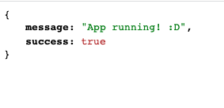
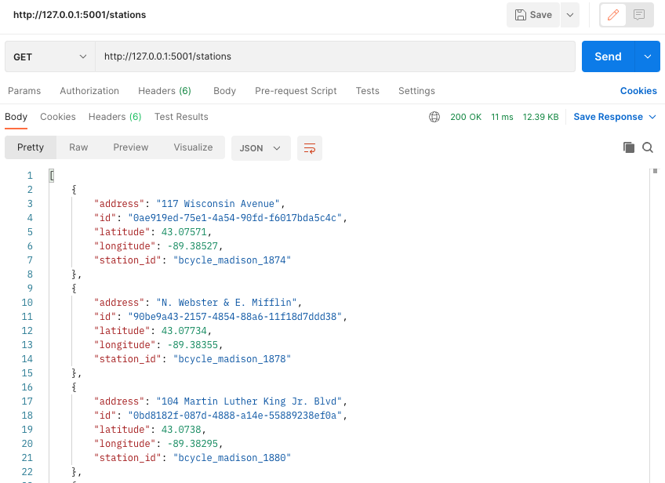
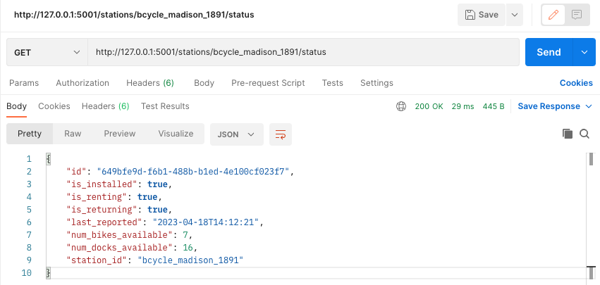
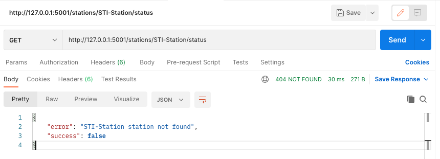
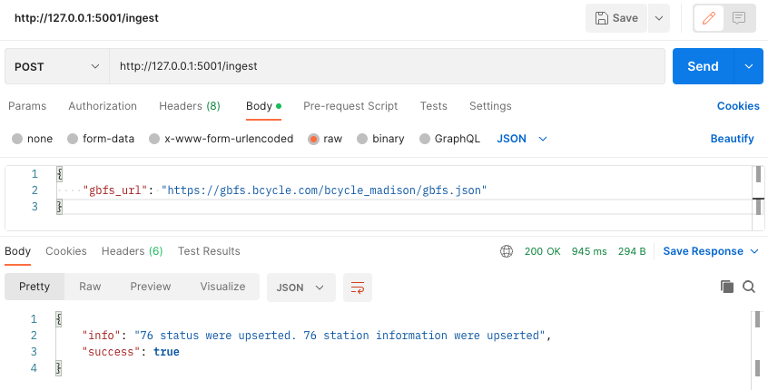

# Movatic Backend Coding Challenge

The following code challenge is an opportunity for you to show off and share your coding ability and
process. During the technical interview we will discuss your implementation with an emphasis on your
process and decisions. You should approach this the same way you would approach writing
long-lasting code that would be used in a production environment.

More info can be found in the challange instructions. [Click here to read it](https://github.com/cavp28/movatic-challenge/blob/42c88ee1e6b522d662b9707f18ea81c9239a0110/Movatic%20Backend%20Coding%20Challenge.pdf).


## Project Structure
```
movatic-challange/
│
├── app/
│   ├── __init__.py
│   ├── api/
│   │   ├── __init__.py
│   │   ├── routes.py
│   │   ├── models.py
│   │   ├── serializers.py
│   │   └── controllers.py
│   ├── config.py
│   ├── extensions.py
│   ├── utils.py
│   └── errors.py
├── Movatic Backend Coding Challenge.pdf
├── docker-compose.yml
├── Dockerfile
├── start.sh
├── stop.sh
├── requirements.txt
├── app.py
└── README.md

```

Here's a brief explanation of each component:

- ***app/***: The directory that contains the application.
    - ***__init__.py***: The file that initializes the Flask app and registers extensions.
    - ***api/***: The directory that contains the API blueprint.
        - ***__init__.py***: The file that initializes the API blueprint and registers routes.
        - ***routes.py***: The file that defines the API routes and their associated view functions.
        - ***models.py***: The file that defines the data models used by the API.
        - ***serializers.py***: The file that defines the serializers used to serialize and deserialize data.
        - ***controllers.py***: The file that defines the controllers that handle the API logic.
    - ***config.py***: The file that contains the app configuration.
    - ***extensions.py***: The file that contains the extensions used by the web app.
    - ***utils.py***: The file that contains any utility functions or classes.
    - ***errors.py***: The file that defines custom error handlers.
- ***requirements.txt***: The file that lists the dependencies required by the app.
- ***app.py***: The file that is the entry point and runs the API.
- ***README.md***: The file that describes the app.
- ***Dockerfile***: Docker file that builds the image for the flask API.
- ***dokcer-compose.yml***: File used to orchestrate all the containers.
- ***start.sh***: Bash file that starts the the docker-compose.
- ***stop.sh***: Bash file that stop the docker containers.

## Requirements
Since we are using docker, the most important requirement is to have docker installed, you can find the installation [here](https://www.docker.com/get-started/). <br>

Also make sure that you have installed Git in your local machine in order to follow the installation instructions. Here's a [tutorial](https://github.com/git-guides/install-git) in case you don't have it.

## Installation

1. Clone the repository:

```sh
git clone https://github.com/cavp28/movatic-challenge.git
```

2. Run the start.sh file (this file will start the docker compose)

```cmd
bash start.sh
```

3. Test you the code.<br>
Click here http://127.0.0.1:5001/, you should have the following result. <br>

<div align="center">
    
</div>

4. You are succesfully running the app in Docker, to exit run:

```cmd
bash stop.sh
```

## Usage

The API allows you to perform CRUD-like operations on the station resource. The available endpoints are:

- ```GET /stations``` endpoint returns a JSON response with a list of stations stored in the database.
- ```GET /stations/{station_id}/status``` endpoint  returns a JSON responsewith the status information of a particular station stored in the database.
- ```POST /ingest``` endpoint that accepts a “gbfs_url” parameter in a JSON message body. The endpoint should query the provided URL and then insert or update data in the database with the latest information about the stations. Assume that the data provided will always be in the same format as <https://gbfs.bcycle.com/bcycle_madison/gbfs.json>

## Examples

This are few examples of how it looks if you try to do it yourself. To test it out, I'm using [Postman](https://www.postman.com/).

```GET /stations```

<div align="center">
    
</div>

<br>

```GET /stations/{station_id}/status```

<div align="center">
    
</div>

<br>

```GET /stations/{station_id}/status``` (not found)

<div align="center">
    
</div>

<br>

```POST /ingest``` <br>
```python
# Payload
{
    "gbfs_url": "https://gbfs.bcycle.com/bcycle_madison/gbfs.json"
}
```
<div align="center">
    
</div>
